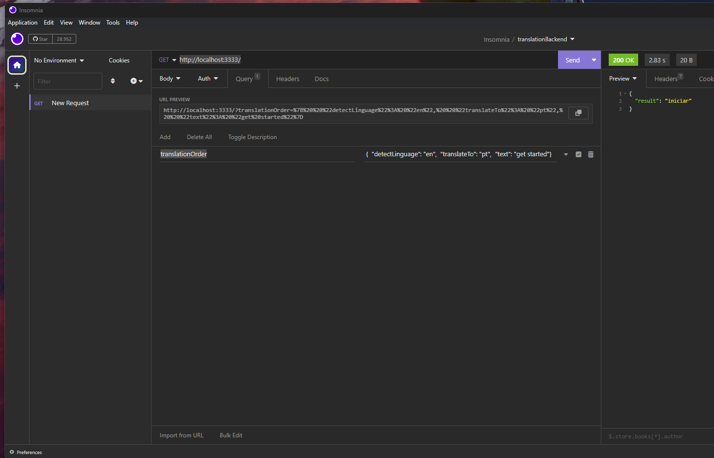

# popUpTranslateApi

## how to test this api:

### step 1: 
In the terminal run: npm run dev

### step 2:
In insomnia or postman create a request of type ✨GET✨ with the url: http://localhost:3333/

And add the query: translationOrder
with example value: { "detectLinguage": "en", "translateTo": "pt", "text": "get started"}

### Example

